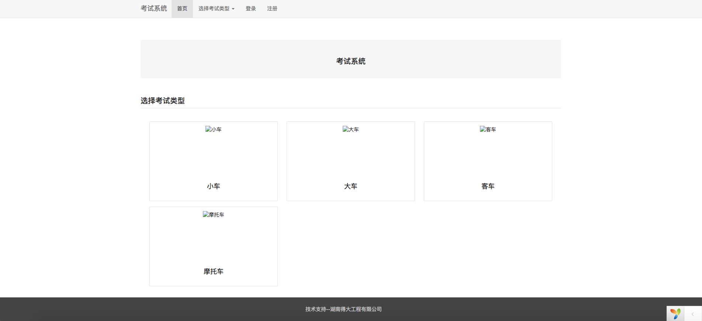
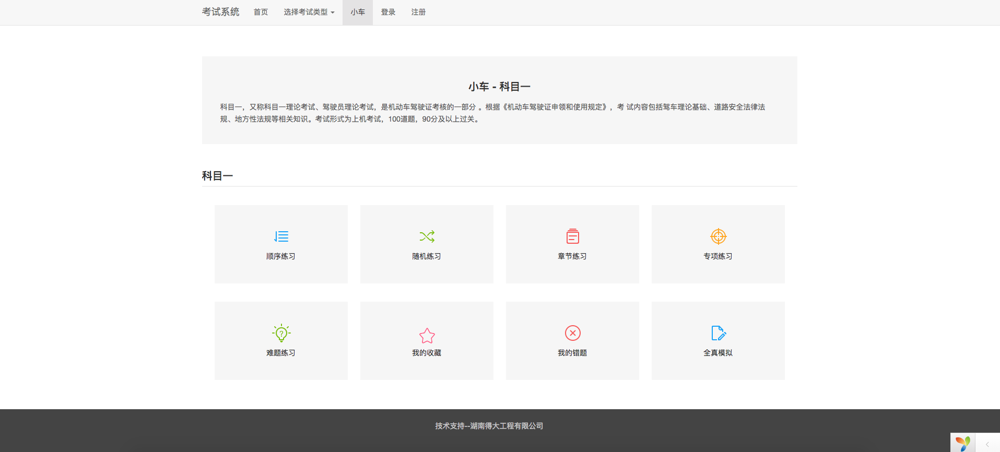
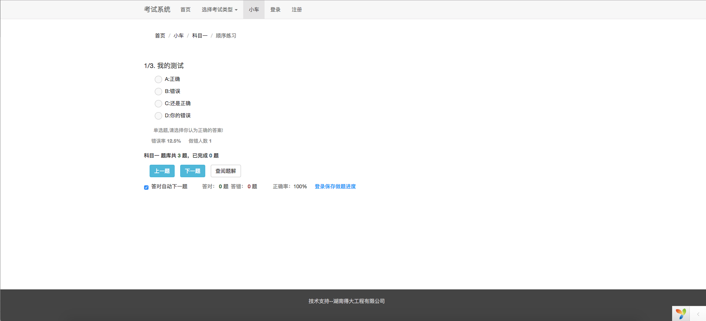
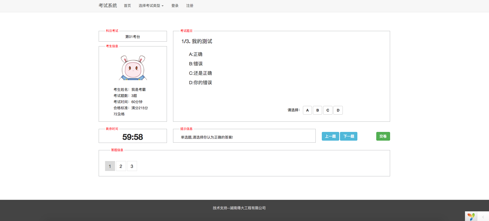
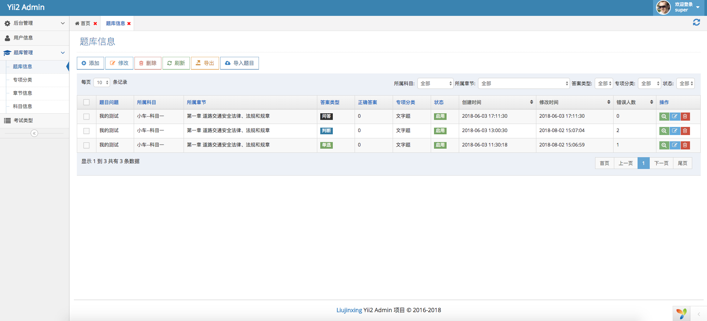

考试系统
--------

## 安装说明

* 提示：请先确定安装了[Composer Asset插件:](https://github.com/fxpio/composer-asset-plugin)
    
    ```
    php composer.phar global require "fxp/composer-asset-plugin:^1.2.0"
    ```
* 不想使用 composer 安装，可以下载：[最新包]() 下载后，需要从第三步开始

1. [git clone 项目](https://github.com/myloveGy/examination)

    ```
    git clone git@github.com:myloveGy/examination.git
    ```

2. composer install 

    ```
    php composer install
    ```

    * composer 如果安装慢的话，可能是 yii 镜像问题，建议镜像使用中国镜像
    
    [中国镜像 https://pkg.phpcomposer.com/](https://pkg.phpcomposer.com/)

3. 将SQL文件导入数据库(文件位于目录下的/docs/examination.sql)

4. 配置虚拟目录(需要开启路由重写)，后台地址：域名/admin 

    > 超级管理员： super 密码： admin123
    
    > 普通管理员： admin 密码： admin123

#### 项目数据库配置文件被我屏蔽掉了，需要在项目 config 中添加 db.php 文件

```php

return [
    'class'       => 'yii\db\Connection',
    'dsn'         => 'mysql:host=localhost;dbname=examination',
    'username'    => 'root',
    'password'    => '',
    'charset'     => 'utf8',
    'tablePrefix' => 'ks_',
];

``` 

### Demo 地址

[demo网址](https://examination.sh-jinger.com)

### 预览
1. 首页

2. 类型选择

3. 顺序答题

4. 模拟考试

5. 后台管理


### 项目参考
[驾考宝典](http://www.jiakaobaodian.com/mnks/kemu1/car-beijing.html)